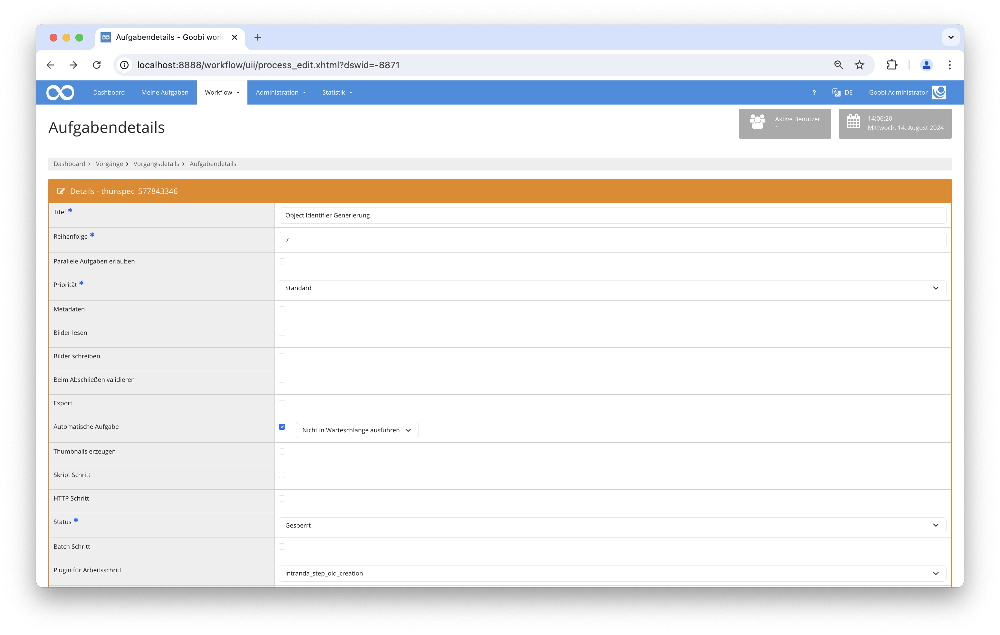

## Einführung
Mit diesem Plugins können Object Identifier für ein Werk und alle Bilder von einem externen Service abgefragt und in die METS-Datei übernommen werden. Anschließend werden die Bilder umbenannt, damit der Dateiname der OID entspricht.


## Installation
Zur Installation des Plugins muss die folgende Datei installiert werden:

```xml
/opt/digiverso/goobi/plugins/step/plugin_intranda_step_oid_creation-base.jar
```

Um zu konfigurieren, wie sich das Plugin verhalten soll, können verschiedene Werte in der Konfigurationsdatei angepasst werden. Die Konfigurationsdatei befindet sich üblicherweise hier:

```xml
/opt/digiverso/goobi/config/plugin_intranda_step_oid_creation.xml
```


## Überblick und Funktionsweise
Zur Inbetriebnahme des Plugins muss dieses in einer Aufgabe im Workflow aktiviert werden. Dies erfolgt durch Auswahl des Plugins `intranda_step_oid_creation` aus der Liste der installierten Plugins. Da das Plugin auf eine METS/MODS Datei angewiesen ist, sollte der Arbeitsschritt nach der Metadatenbearbeitung stattfinden.



Nachdem das Plugin vollständig installiert und eingerichtet wurde, wird es üblicherweise automatisch innerhalb des Workflows ausgeführt, so dass keine manuelle Interaktion mit dem Nutzer erfolgt. Stattdessen erfolgt der Aufruf des Plugins durch den Workflow im Hintergrund und führt die Integration der OIDs in die METS/MODS Datei aus.

Hierzu wird die METS/MODS-Datei geöffnet und die darin befindliche Paginierung der Seiten gezählt. Es wird geprüft, ob das Werk oder einzelne Seiten noch keine Object Identifier haben. Ist das der Fall, werden die benötigten OIDs von der konfigurierten API bezogen und in den einzelnen Objekten eingetragen.

Im Anschluss werden die Dateien in allen Ordnern umbenannt, so dass sie der Benennung `{OID}.extension` entsprechen.

Damit der spätere Export samt Hash-Werten funktioniert, sollte im Anschluss an die Ausführung dieses Plugins ein Arbeitsschritt zur Generierung von Checksummen für die Bilder ausgeführt werden. Dazu kann der folgende Aufruf verwendet werden:

```bash
/opt/digiverso/goobi/scripts/create_checksum.sh -s {imagepath} -p {processpath}
```


## Konfiguration 
Die Konfiguration des Plugins ist folgendermaßen aufgebaut:

```xml
<config_plugin>
    <url>https://example.com/management/api/oid/new/</url>
    <username></username>
    <password></password>
    <headerparam>Accept</headerparam>
    <headerValue>application/json</headerValue>
</config_plugin>
```

Die einzelnen Felder haben folgende Bedeutung:

| Wert | Beschreibung |
| :--- | :--- |
| `url` | Dieses Feld ist ein Pflichtfeld und enthält die URL zur OID-API. |
| `username` | Dieser Parameter enthält den Nutzernamen, falls eine Basic Authentication verwendet wird. Wenn die API ohne Authentifizierung erreichbar ist, kann dieser Parameter leer bleiben. |
| `password` | Dieser Parameter enthält das Passwort, falls eine Basic Authentication verwendet wird. Wenn die API ohne Authentifizierung erreichbar ist, kann dieser Parameter leer bleiben. |
| `headerparam` | Dieser Parameter definiert den Namen eines HTTP Header Parameters, der beim Aufruf gesetzt wird. Wenn kein zusätzlicher Parameter benötigt wird, kann der Parameter leer bleiben. |
| `headerValue` | Dieser Parameter definiert den Wert eines HTTP Header Parameters, der beim Aufruf gesetzt wird. Wenn kein zusätzlicher Parameter benötigt wird, kann das Feld leer bleiben. |