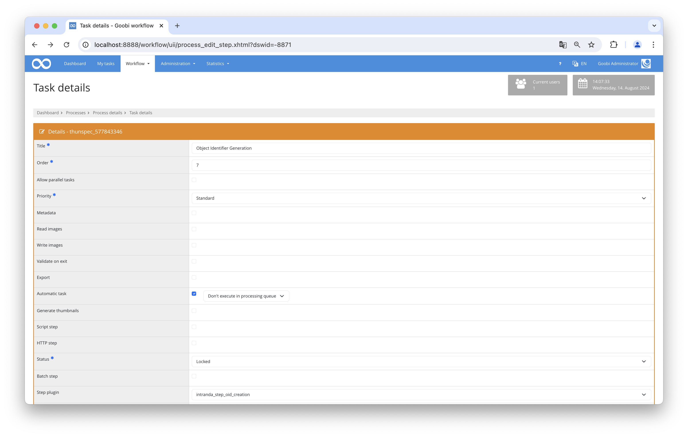

## Introduction
With this plugin, object identifiers for a work and all images can be retrieved from an external service and transferred to the METS file. The images are then renamed so that the file name corresponds to the OID.


## Installation
To install the plugin, the following file must be installed:

```xml
/opt/digiverso/goobi/plugins/step/plugin_intranda_step_oid_creation-base.jar
```

To configure how the plugin should behave, various values can be adjusted in the configuration file. The configuration file is usually located here:

```xml
/opt/digiverso/goobi/config/plugin_intranda_step_oid_creation.xml
```


## Overview and functionality
To use the plug-in, it must be activated in a task in the workflow. This is done by selecting the plugin `intranda_step_oid_creation` from the list of installed plugins. Since the plugin depends on a METS/MODS file, this step should be performed after the metadata processing.



Once the plugin is fully installed and set up, it is usually executed automatically within the workflow, so there is no manual interaction with the user. Instead, the workflow calls the plugin in the background and performs the integration of the OIDs into the METS/MODS file.

For this purpose the METS/MODS file is opened and the pagination of the pages in it is counted. It is checked whether the work or individual pages do not yet have object identifiers. If this is the case, the required OIDs are obtained from the configured API and entered in the individual objects.

Subsequently, the files in all folders are renamed so that they correspond to the name `{OID}.extension`.

In order for the later export including hash values to work, a work step for generating checksums for the images should be executed after the execution of this plugin. The following call can be used for this:

```bash
/opt/digiverso/goobi/scripts/create_checksum.sh -s {imagepath} -p {processpath}
```


## Configuration
The configuration of the plugin is structured as follows:

```xml
<config_plugin>
    <url>https://example.com/management/api/oid/new/</url>
    <username></username>
    <password></password>
    <headerparam>Accept</headerparam>
    <headerValue>application/json</headerValue>
</config_plugin>
```

The individual fields have the following meaning:

| Value | Description |
| :--- | :--- |
| `url` | This field is a mandatory field and contains the URL to the OID API. |
| `username` | This parameter contains the user name if Basic Authentication is used. If the API is accessible without authentication, this parameter can be left blank. |
| `password` | This parameter contains the password if Basic Authentication is used. If the API is accessible without authentication, this parameter can be left blank. |
| `headerparam` | This parameter defines the name of an HTTP Header parameter that is set when it is called. If no additional parameter is required, the parameter can be left empty. |
| `headerValue` | This parameter defines the value of an HTTP Header parameter that is set when the call is made. If no additional parameter is required, the field can be left empty. |
